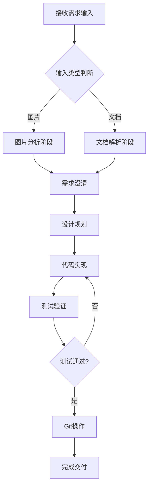

# 需求设计实现工作流技能

本技能定义了从需求分析到代码交付的完整工作流程，适用于处理用户上传的设计图片、需求文档或详细设计文档。

---

## 1. 适用场景

- 用户上传 UI 设计图片（截图、原型图、线框图等）
- 用户提供需求文档（PRD、功能规格说明等）
- 用户提供详细设计文档（技术方案、接口设计等）
- 需要根据设计进行功能实现并提交代码

---

## 2. 工作流程概览



---

## 3. 详细步骤说明

### 阶段一：需求输入分析

#### 3.1 图片输入处理

当用户上传设计图片时，执行以下分析步骤：

1. **视觉元素识别**
   - 识别页面布局结构（头部、侧边栏、内容区、底部等）
   - 识别 UI 组件类型（表格、表单、按钮、图表、卡片等）
   - 识别颜色方案和主题风格
   - 识别交互元素（可点击区域、输入框、下拉菜单等）

2. **功能推断**
   - 根据 UI 元素推断功能需求
   - 识别数据展示需求（列表、详情、统计等）
   - 识别用户交互需求（增删改查、筛选、导出等）

3. **技术映射**
   - 将 UI 元素映射到对应的 Element Plus 组件
   - 确定所需的自定义组件
   - 评估 ECharts 等图表库的使用需求

#### 3.2 文档输入处理

当用户提供需求或详设文档时，执行以下解析步骤：

1. **需求提取**
   - 提取功能需求列表
   - 提取非功能性需求（性能、安全等）
   - 提取业务规则和约束条件

2. **技术需求分析**
   - 识别 API 接口需求
   - 识别数据结构需求
   - 识别状态管理需求

3. **依赖分析**
   - 检查现有项目结构和组件
   - 识别可复用的组件和工具
   - 确定需要新增的依赖

---

### 阶段二：需求澄清与确认

> [!IMPORTANT]
> 在开始实现前，必须与用户确认需求理解是否正确。

1. **生成需求摘要**
   - 列出识别到的功能点
   - 列出技术实现方案
   - 标注不确定或需要澄清的点

2. **提出澄清问题**（如有必要）
   - 功能边界不清晰的地方
   - 设计细节缺失的部分
   - 多种实现方案需要选择的情况

3. **等待用户确认**
   - 用户确认需求理解正确后继续
   - 根据用户反馈调整需求理解

---

### 阶段三：设计规划

#### 3.3 创建实现计划

在 `implementation_plan.md` 中记录以下内容：

```markdown
# [功能名称] 实现计划

## 需求概述
[简要描述需求来源和目标]

## 设计分析
[基于图片/文档的分析结论]

## 技术方案

### 新增文件
- `src/views/[module]/[page].vue` - [页面描述]
- `src/components/[ComponentName].vue` - [组件描述]
- `src/api/[module].ts` - [API 接口描述]
- `mock/[module].ts` - [Mock 数据描述]

### 修改文件
- `src/router/index.ts` - 添加路由配置
- ...

### 组件结构
[组件层级和数据流说明]

## 验证计划
[测试步骤和验收标准]
```

#### 3.4 任务分解

在 `task.md` 中创建任务清单：

```markdown
# [功能名称] 任务清单

## 准备工作
- [ ] 确认需求理解
- [ ] 创建实现计划

## 代码实现
- [ ] 创建页面组件
- [ ] 创建业务组件
- [ ] 实现 API 接口
- [ ] 配置 Mock 数据
- [ ] 添加路由配置
- [ ] 样式调整

## 测试验证
- [ ] 功能测试
- [ ] 样式验收
- [ ] 响应式测试

## 代码提交
- [ ] Git 提交
```

---

### 阶段四：代码实现

#### 3.5 遵循项目规范

> [!NOTE]
> 实现过程中必须严格遵循 `vue3-vite-ts-project-standard/SKILL.md` 中定义的规范。

**核心规范要点**：

1. **组件结构**
   ```vue
   <template>
     <!-- 视图层 -->
   </template>
   
   <script setup lang="ts">
   // 1. Imports
   // 2. DefineProps & DefineEmits
   // 3. State (ref, reactive)
   // 4. Computed
   // 5. Watchers
   // 6. Methods
   // 7. Lifecycle Hooks
   // 8. Expose
   </script>
   
   <style scoped lang="scss">
   /* 样式层 */
   </style>
   ```

2. **命名规范**
   - 组件名：大驼峰 (PascalCase)
   - 方法名：小驼峰 (camelCase)
   - 所有注释：中文

3. **API 封装**
   - 所有接口封装在 `src/api/` 目录
   - 使用 TypeScript 强类型定义

4. **样式规范**
   - 使用 SCSS + BEM 命名
   - 必须添加 `scoped` 属性
   - 使用 CSS 变量和项目主题

---

### 阶段五：测试验证

#### 3.6 功能验证步骤

1. **启动开发服务器**
   ```bash
   npm run dev
   ```

2. **功能测试清单**
   - [ ] 页面正常渲染
   - [ ] 数据正确显示
   - [ ] 交互功能正常
   - [ ] 表单验证生效
   - [ ] API 调用正确

3. **视觉验收**
   - [ ] 与设计图一致性对比
   - [ ] 颜色、间距、字体检查
   - [ ] 响应式布局测试

4. **浏览器测试**
   - 使用浏览器工具截图验证
   - 记录测试结果到 `walkthrough.md`

#### 3.7 问题修复

如果测试发现问题：
1. 记录问题描述
2. 分析问题原因
3. 实施修复
4. 重新测试验证

---

### 阶段六：Git 操作

#### 3.8 判断 Git 状态

检查当前项目的 Git 状态：

```bash
git status
git remote -v
```

#### 3.9 场景处理

**场景 A：已有 Git 仓库**

使用 `/git_commit_and_push` workflow：

1. 检查更改文件
2. 添加到暂存区
3. 提交更改（使用有意义的中文提交信息）
4. 推送到远程仓库

**场景 B：需要创建新仓库**

使用 `/create_new_repo` workflow：

1. 初始化 Git 仓库
2. 创建首次提交
3. 关联远程仓库
4. 推送代码

#### 3.10 提交信息规范

```
feat: [功能模块] 功能描述

- 新增 XXX 页面组件
- 实现 XXX 功能
- 添加 XXX 接口
```

---

## 4. 快速参考

### 常用命令

| 操作 | 命令 |
|------|------|
| 启动开发服务器 | `npm run dev` |
| 构建生产版本 | `npm run build` |
| 检查代码状态 | `git status` |
| 提交代码 | `git add . && git commit -m "message"` |
| 推送代码 | `git push origin <branch>` |

### 相关资源链接

- **项目规范**: `e:\code\skills\vue3-vite-ts-project-standard\SKILL.md`
- **Git 提交流程**: `.agent/workflows/git_commit_and_push.md`
- **创建仓库流程**: `.agent/workflows/create_new_repo.md`

---

## 5. 注意事项

> [!WARNING]
> 以下是容易遗漏的关键点：

1. **需求确认优先**：开始编码前必须确认需求理解正确
2. **规范遵循**：严格遵循项目编码规范
3. **中文注释**：所有代码注释必须使用中文
4. **测试先行**：确保功能测试通过后再提交代码
5. **有意义的提交**：Git 提交信息要清晰描述改动内容

> [!CAUTION]
> 禁止事项：
> - 禁止跳过需求确认直接编码
> - 禁止提交未测试的代码
> - 禁止使用英文注释
> - 禁止在组件中直接调用 axios

---

## 6. 示例场景

### 示例：根据截图实现列表页面

**用户输入**：上传了一张数据列表页面的截图

**执行流程**：

1. **分析截图**
   - 识别：表格组件、搜索筛选区、分页组件
   - 推断：需要实现数据列表页，支持搜索和分页

2. **生成计划**
   ```markdown
   ## 实现计划
   - 创建 `src/views/data/list/index.vue`
   - 使用 `el-table` + `el-pagination`
   - 添加筛选表单
   - 配置 Mock 数据
   ```

3. **实现代码**
   - 按规范创建页面组件
   - 封装 API 接口
   - 配置路由

4. **测试验证**
   - 启动开发服务器
   - 验证功能和样式
   - 截图对比

5. **提交代码**
   ```bash
   git add .
   git commit -m "feat: 数据管理模块 - 新增数据列表页面"
   git push origin main
   ```
